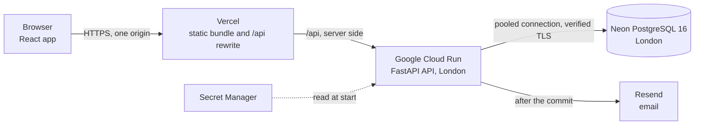
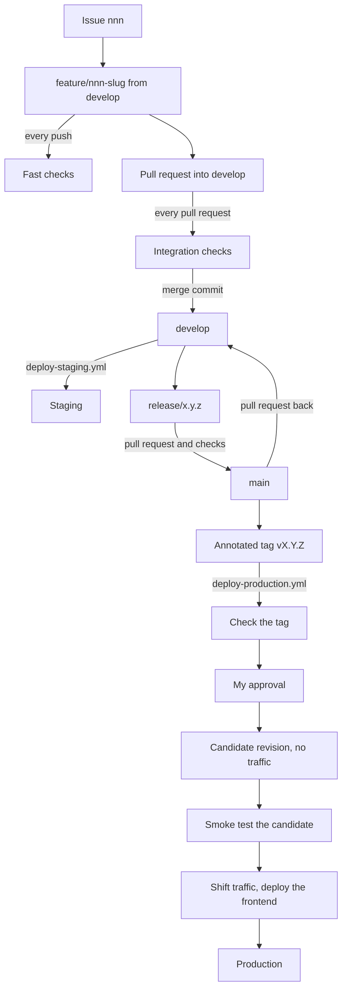

<p align="center">
  
</p>

# Toolshed Hire

[](https://github.com/teon-artilionAI/toolshed-hire/actions/workflows/ci-fast.yml)
[](https://github.com/teon-artilionAI/toolshed-hire/actions/workflows/deploy-staging.yml)
[](https://github.com/teon-artilionAI/toolshed-hire/actions/workflows/deploy-production.yml)

Toolshed Hire is a rental management system for a fictional tool and equipment
hire business with three branches in Cape Town, which today runs on a paper
diary and a WhatsApp group. A customer checks availability at all three
branches at once and books named units online. Counter staff book walk-ins,
hand equipment over, take it back and settle the deposit, and the database
itself refuses to promise one unit to two hires.

This repository holds Task 2 of my INSY7315 Work Integrated Learning project,
which is the built system. I am Teon Kleynhans, ST10434209, and I work on it
alone.

## Links

| What | Where |
|---|---|
| Live system | <https://toolshed-hire.vercel.app> |
| Staging | <https://toolshed-hire-staging.vercel.app> |
| Recorded presentation | <!-- final: video link --> |
| Slides | <!-- final: slides link --> The outline and the demonstration script are in [presentation.md](docs/task2/presentation.md). |
| Task 1 design document | [INSY7315_Task1_ToolshedHire.pdf](docs/task1/INSY7315_Task1_ToolshedHire.pdf) |
| Task 2 evidence | [docs/task2](docs/task2/README.md) |

## Demo login

| Role | Email | Password |
|---|---|---|
| Customer | `w.adonis@buildright.co.za` | `Hire-UQdzV8RMo50z` |

The counter staff and admin logins are never published in this repository, and
I show them in the recorded presentation and send them to my lecturer privately.

## Try it in five minutes

These steps are for the demo customer on the live system.

1. Open <https://toolshed-hire.vercel.app>. The catalogue home (SC-01) needs no
   account. Pick a start date from tomorrow onwards and an end date, and search.
2. The results (SC-02) say for every model whether each branch has one free for
   those dates. Choose a branch to narrow the list.
3. Open a model (SC-03). The rates, the deposit and the late fee are on the
   page. The price on the booking card is the server's quote for the dates and
   the quantity. Add it to the hire basket.
4. Open the basket (SC-04) and review it. The site asks you to sign in with the
   demo login and then brings you back.
5. The review shows the server's figures. Hold sets named units aside for thirty
   minutes with a countdown. Confirm gives you a booking reference.
6. My Hires (SC-07) lists the booking. Open it (SC-08) and cancel it, so the
   units go back on the shelf for the next person.
7. Account (SC-09) shows the profile and the hire history. The closed hire
   `TSH-H-26-000098` is the worked example from the Task 1 design document. Its
   R1,200.00 deposit was held, R240.00 was kept for two days late at R120.00 a
   day, R960.00 was returned and nothing was left to pay.
8. While signed in as the customer, open `/counter`. The screen refuses, and the
   API would refuse as well.

The recorded presentation shows the other two roles on the same production
system.

- A counter assistant at Cape Town CBD reads the day's dashboard and the branch
  diary, registers a walk-in, books one unit for today, checks it out with the
  deposit taken and takes it back with the deposit released.
- The same assistant finds a unit by its tag with the asset locator, which
  searches all three branches, marks a booking that nobody collected as a no
  show, works the overdue list and opens the worked example by its reference.
- The owner signs in as the administrator. <!-- final: what the admin part of the video shows -->

The API scales down to nothing when it is idle and the database suspends after
five minutes without a query, so both are asleep when nobody has used the site
for a while. The first request after a quiet spell wakes them and takes about
<!-- final: measured cold start --> seconds. A loading state shows while it
waits, and every request after it is quick.

## What each task delivered

| Task | What I delivered | Where it is |
|---|---|---|
| Task 1 | The design document, submitted on 16 August 2026, with the requirements, the design, security, the pipeline, the running costs and change management. A clickable prototype of all 24 screens on sample data, and a walking skeleton of the API. | [The Task 1 design document](docs/task1/INSY7315_Task1_ToolshedHire.pdf), and the baseline in [CHANGELOG.md](CHANGELOG.md) |
| Task 2 | This system. The front end, the back end and its database, hosting in two environments, the GitHub workflow and pipeline, and the recorded presentation. | This README and [docs/task2](docs/task2/README.md) |
| Task 3 | To come. The final release `v1.0.0`, the report and the user guide. | |

This table says where to find the evidence for each part of Task 2.

| Part of Task 2 | Where to look |
|---|---|
| Look and feel, branding | The live system, and the colours, type and contrast notes in [tailwind.config.js](frontend/tailwind.config.js) <!-- final: link the Task 2 screenshots --> |
| Usability and feedback | [frontend/README.md](frontend/README.md), under Shared states, Booking a hire and each screen's section |
| Responsive design and accessibility | [narrow-screens.spec.ts](frontend/e2e/narrow-screens.spec.ts), [accessibility.spec.ts](frontend/e2e/accessibility.spec.ts), NFR-13 in the [test plan](docs/task2/test-plan-and-results.md) |
| Back-end code and design patterns | [Architecture](#architecture) below, and [backend/README.md](backend/README.md) |
| Database | [The schema](backend/README.md#the-schema), [the constraint](backend/README.md#the-constraint), [alembic/versions](backend/alembic/versions) |
| APIs | [Endpoints](backend/README.md#endpoints), and the OpenAPI document [openapi.json](backend/openapi.json) |
| Security | [security-controls.md](docs/task2/security-controls.md) |
| Business logic and data flow | [Requirements traceability](#requirements-traceability) below, and the reservation lifecycle in [backend/README.md](backend/README.md#the-reservation-lifecycle) |
| Hosting and connectivity | The live links above, [infra/SETUP.md](infra/SETUP.md) and [infra/OPERATIONS.md](infra/OPERATIONS.md) |
| Stability and the reasons for each choice | [infra/SETUP.md](infra/SETUP.md), [deviations.md](docs/task2/deviations.md) |
| Branching and workflow | [CONTRIBUTING.md](CONTRIBUTING.md), the [merged pull requests](https://github.com/teon-artilionAI/toolshed-hire/pulls?q=is%3Apr+is%3Amerged) |
| Automated tests and deployment | [Pipeline and branching](#pipeline-and-branching) below, and [test-plan-and-results.md](docs/task2/test-plan-and-results.md) |
| Presentation | The video link above, and [presentation.md](docs/task2/presentation.md) |

## Requirements traceability

Each functional requirement from the Task 1 design document, in a few words of
my own. The statuses are those of `develop` on 3 October 2026.
<!-- final: refresh every status, branch and test after branches 015 to 022 -->
Twenty are built, one is in progress, six are partly built and one is planned
for the final release. Every issue names the requirements it covers, and every
branch and pull request carries its issue number.

| FR | Requirement | Status | Branch and pull request | Screens | Tests that prove it |
|---|---|---|---|---|---|
| FR-01 | Register, verify an email, sign in, reset a password, edit own details | Built | 007 [#40](https://github.com/teon-artilionAI/toolshed-hire/pull/40), 008 [#41](https://github.com/teon-artilionAI/toolshed-hire/pull/41), 011 [#46](https://github.com/teon-artilionAI/toolshed-hire/pull/46) | SC-05, SC-06, SC-09 | [test_register.py](backend/tests/api/test_register.py), [test_password_reset.py](backend/tests/api/test_password_reset.py), [account.spec.ts](frontend/e2e/account.spec.ts) |
| FR-02 | Public catalogue with rates, deposit and hire limits | Built | 006 [#39](https://github.com/teon-artilionAI/toolshed-hire/pull/39) | SC-01, SC-03 | [test_catalogue_browse.py](backend/tests/api/test_catalogue_browse.py), [catalogue.spec.ts](frontend/e2e/catalogue.spec.ts) |
| FR-03 | One search says per branch whether a model is free | Built | 006 [#39](https://github.com/teon-artilionAI/toolshed-hire/pull/39) | SC-02, SC-03 | [test_availability_search.py](backend/tests/integration/test_availability_search.py), [test_availability_list.py](backend/tests/integration/test_availability_list.py) |
| FR-04 | Units out of service are never offered | Built | 006 [#39](https://github.com/teon-artilionAI/toolshed-hire/pull/39) | SC-02, SC-03 | [test_availability_search.py](backend/tests/integration/test_availability_search.py) |
| FR-05 | Several models, one period, one branch, priced before commitment | Built | 009 [#42](https://github.com/teon-artilionAI/toolshed-hire/pull/42), 010 [#43](https://github.com/teon-artilionAI/toolshed-hire/pull/43) | SC-03, SC-04 | [test_quote.py](backend/tests/api/test_quote.py), [test_reservation_routes.py](backend/tests/api/test_reservation_routes.py), [reservation-changes.spec.ts](frontend/e2e/reservation-changes.spec.ts) |
| FR-06 | Named units on every line, never a count | Built | 010 [#43](https://github.com/teon-artilionAI/toolshed-hire/pull/43) | SC-04, SC-13 | [test_hold_all_or_nothing.py](backend/tests/unit/test_hold_all_or_nothing.py), [test_concurrent_allocation.py](backend/tests/integration/test_concurrent_allocation.py) |
| FR-07 | No unit ever holds two overlapping bookings | Built | 002 [#24](https://github.com/teon-artilionAI/toolshed-hire/pull/24), 005 [#38](https://github.com/teon-artilionAI/toolshed-hire/pull/38) | SC-04, SC-13 | [test_exclusion_constraint.py](backend/tests/integration/test_exclusion_constraint.py), [test_concurrent_holds.py](backend/tests/integration/test_concurrent_holds.py) |
| FR-08 | Thirty minute hold that lapses by itself | Built | 010 [#43](https://github.com/teon-artilionAI/toolshed-hire/pull/43) | SC-04 | [test_expire_holds_sweep.py](backend/tests/unit/test_expire_holds_sweep.py), [test_hold_expiry_sweep.py](backend/tests/integration/test_hold_expiry_sweep.py) |
| FR-09 | Confirm only when fully allocated and the email is verified | Built | 010 [#43](https://github.com/teon-artilionAI/toolshed-hire/pull/43) | SC-04, SC-13 | [test_confirm_reservation_use_case.py](backend/tests/unit/test_confirm_reservation_use_case.py), [test_reservation_states.py](backend/tests/unit/test_reservation_states.py) |
| FR-10 | Confirmation email with its delivery outcome recorded | Built | 005 [#38](https://github.com/teon-artilionAI/toolshed-hire/pull/38), 010 [#43](https://github.com/teon-artilionAI/toolshed-hire/pull/43) | SC-04 | [test_notification_outbox.py](backend/tests/integration/test_notification_outbox.py), [test_resend_adapter.py](backend/tests/unit/test_resend_adapter.py) |
| FR-11 | See own bookings and cancel a held or confirmed one | Built | 010 [#43](https://github.com/teon-artilionAI/toolshed-hire/pull/43) | SC-07, SC-08 | [test_cancellation_transaction.py](backend/tests/integration/test_cancellation_transaction.py), [reservation.spec.ts](frontend/e2e/reservation.spec.ts) |
| FR-12 | An uncollected booking becomes a no show with a strike | Built | 013 [#48](https://github.com/teon-artilionAI/toolshed-hire/pull/48) | SC-11 | [test_no_show_sweep.py](backend/tests/integration/test_no_show_sweep.py), [test_no_show_races.py](backend/tests/integration/test_no_show_races.py) |
| FR-13 | Find a customer, register a walk-in with no login | Built | 012 [#47](https://github.com/teon-artilionAI/toolshed-hire/pull/47) | SC-12 | [test_customer_lookup.py](backend/tests/api/test_customer_lookup.py), [test_walk_in.py](backend/tests/api/test_walk_in.py) |
| FR-14 | Same-day counter booking through the online path | Built | 012 [#47](https://github.com/teon-artilionAI/toolshed-hire/pull/47) | SC-13 | [test_counter_bookings.py](backend/tests/api/test_counter_bookings.py), [counter.spec.ts](frontend/e2e/counter.spec.ts) |
| FR-15 | Find any unit by tag at any branch, read only | Built | 013 [#48](https://github.com/teon-artilionAI/toolshed-hire/pull/48) | SC-17 | [test_asset_locator.py](backend/tests/api/test_asset_locator.py), [counter-overview.spec.ts](frontend/e2e/counter-overview.spec.ts) |
| FR-16 | Today's dashboard and a diary for any date | Built | 013 [#48](https://github.com/teon-artilionAI/toolshed-hire/pull/48) | SC-10, SC-11 | [test_counter_dashboard.py](backend/tests/api/test_counter_dashboard.py), [test_counter_diary.py](backend/tests/api/test_counter_diary.py) |
| FR-17 | Checkout per unit with the deposit taken | Built | 012 [#47](https://github.com/teon-artilionAI/toolshed-hire/pull/47) | SC-14 | [test_checkout_transaction.py](backend/tests/integration/test_checkout_transaction.py), [test_checkout_race.py](backend/tests/integration/test_checkout_race.py) |
| FR-18 | Returns item by item until the last one is back | Built | 014 [#50](https://github.com/teon-artilionAI/toolshed-hire/pull/50) | SC-15 | [test_return_rules.py](backend/tests/unit/test_return_rules.py), [test_return_transaction.py](backend/tests/integration/test_return_transaction.py) |
| FR-19 | One late fee policy that staff confirm and cannot set | Built | 014 [#50](https://github.com/teon-artilionAI/toolshed-hire/pull/50) | SC-15, SC-18 | [test_late_fee_policy.py](backend/tests/unit/test_late_fee_policy.py), [test_one_place_for_a_late_fee.py](backend/tests/unit/test_one_place_for_a_late_fee.py) |
| FR-20 | Damage report with an explicit charge decision, quarantine and resolution | In progress on 015 <!-- final: FR-20 status once 015 merges --> | 015, issue [#15](https://github.com/teon-artilionAI/toolshed-hire/issues/15) | SC-16, SC-21 | <!-- final: the damage tests from 015 --> |
| FR-21 | Deposit settled at return, the rest released, a shortfall carried | Built | 014 [#50](https://github.com/teon-artilionAI/toolshed-hire/pull/50) | SC-15 | [test_deposit_settlement.py](backend/tests/unit/test_deposit_settlement.py), [test_returns.py](backend/tests/api/test_returns.py), [test_loss_and_balance.py](backend/tests/api/test_loss_and_balance.py) |
| FR-22 | Catalogue and prices kept once, bookings keep their prices | Partly built. Prices are copied onto every booking. The admin screen is planned. | 010 [#43](https://github.com/teon-artilionAI/toolshed-hire/pull/43), 019 [#19](https://github.com/teon-artilionAI/toolshed-hire/issues/19) | SC-20 | [test_reservation_lifecycle.py](backend/tests/integration/test_reservation_lifecycle.py), [test_booking_customer_profile.py](backend/tests/api/test_booking_customer_profile.py) |
| FR-23 | Asset register and lifecycle, no retirement while booked | Partly built. The asset state model is in force. The register screen is planned. | 012 [#47](https://github.com/teon-artilionAI/toolshed-hire/pull/47), 020 [#20](https://github.com/teon-artilionAI/toolshed-hire/issues/20) | SC-21 | [test_asset_lifecycle.py](backend/tests/unit/test_asset_lifecycle.py) |
| FR-24 | Utilisation and gross contribution with export | Planned for the final release <!-- final: 017 --> | 017 [#17](https://github.com/teon-artilionAI/toolshed-hire/issues/17) | SC-19, SC-22 | None yet |
| FR-25 | Staff accounts and roles, deny by default | Partly built. Every route declares its policy. Staff management is planned. | 007 [#40](https://github.com/teon-artilionAI/toolshed-hire/pull/40), 021 [#21](https://github.com/teon-artilionAI/toolshed-hire/issues/21) | SC-23 | [test_route_policies.py](backend/tests/api/test_route_policies.py), [test_ownership_and_branch_scope.py](backend/tests/api/test_ownership_and_branch_scope.py) |
| FR-26 | Append-only log of every change, readable by the owner | Partly built. Every change writes its audit event and the application cannot alter one. The log screen is planned. | 003 [#25](https://github.com/teon-artilionAI/toolshed-hire/pull/25), 005 [#38](https://github.com/teon-artilionAI/toolshed-hire/pull/38), 018 [#18](https://github.com/teon-artilionAI/toolshed-hire/issues/18) | SC-24 | [test_application_role.py](backend/tests/integration/test_application_role.py), [test_booking_audit_and_notification.py](backend/tests/api/test_booking_audit_and_notification.py) |
| FR-27 | Waive or reverse a charge with a reason, never edit a settled one | Partly built. A settled charge cannot be edited. Waivers and reversals are planned. | 014 [#50](https://github.com/teon-artilionAI/toolshed-hire/pull/50), 018 [#18](https://github.com/teon-artilionAI/toolshed-hire/issues/18) | SC-24 | [test_settled_charge_guard.py](backend/tests/unit/test_settled_charge_guard.py) |
| FR-28 | Own charges, deposit position and a statement | Partly built. History, charges and deposit are on SC-09. The statement download is planned. | 014 [#50](https://github.com/teon-artilionAI/toolshed-hire/pull/50) | SC-09 | [test_rental_lists.py](backend/tests/api/test_rental_lists.py), [SC09-Hire-History.test.tsx](frontend/src/features/customer/SC09-Hire-History.test.tsx) |

The non-functional requirements NFR-01 to NFR-18 are mapped to how I verify
each one in [test-plan-and-results.md](docs/task2/test-plan-and-results.md).

## Architecture

The backend is FastAPI on Python 3.12 with SQLModel and PostgreSQL 16. The
frontend is React 19 with TypeScript, Vite and Tailwind CSS.

| Layer | Folder | Holds |
|---|---|---|
| Domain | [app/domain](backend/app/domain) | The business rules as plain classes. No framework, no SQL, no input or output. |
| Application | [app/application](backend/app/application) | One use case per action, the transaction boundary, and the ports it works through. |
| Infrastructure | [app/infrastructure](backend/app/infrastructure) | The SQL repositories, the unit of work, the clock, hashing and the email adapter. |
| API | [app/api](backend/app/api) | Routers, request and response schemas, access policies, and the composition root that wires the rest together. |

The eight modules of the design keep the same name in every layer they appear
in.

| Module | Covers | State |
|---|---|---|
| `identity` | Accounts, sessions, customers and walk-ins | Built |
| `catalogue` | Categories, models and the asset locator | Built |
| `availability` | The free or not free search and the allocation of named units | Built |
| `booking` | Reservations, their eight states and no shows | Built |
| `hire` | Checkout, rentals, returns, losses and deposit settlement | Built, damage in progress |
| `money` | `Money`, VAT, the pricing policy and quotes | Built |
| `notification` | The outbox and the email gateway | Built |
| `reporting` | Utilisation and gross contribution | Planned <!-- final: 017 --> |

### The request path



The browser only ever talks to the site's own address. Vercel serves the built
bundle and rewrites every `/api` request to Cloud Run on the server side, so the
refresh cookie stays on one origin and the Content Security Policy can allow
`connect-src 'self'` and nothing else. The API reads its secrets from Secret
Manager, connects to the database as a restricted role that cannot rewrite the
audit trail, and sends email through Resend once the transaction has committed.

### The four design patterns

| Pattern | Where | What it does here |
|---|---|---|
| Repository with Unit of Work | [application/unit_of_work.py](backend/app/application/unit_of_work.py), [infrastructure/unit_of_work.py](backend/app/infrastructure/unit_of_work.py), for example [SqlAssetRepository](backend/app/infrastructure/availability.py) and [SqlReservationRepository](backend/app/infrastructure/booking.py) | A hold writes allocations, a new status and an audit event. One unit of work owns that transaction, so all of it commits or none of it does. |
| Adapter | [application/notification/ports.py](backend/app/application/notification/ports.py), [infrastructure/notification](backend/app/infrastructure/notification) | `NotificationGateway` is the port and `ResendEmailAdapter` is the only class that knows which provider sends the email. A failed send never rolls a booking back. |
| Strategy | [domain/policies](backend/app/domain/policies) | `PricingPolicy` and `LateFeePolicy`, each with a standard implementation and a fixed one for tests. A test reads every module to prove no other code works out a price or a late fee. |
| State | [domain/states](backend/app/domain/states) | The eight reservation states. The base state refuses every move, and each state allows only the moves that are legal from it. |

### Why the layers are enforced

The rules that make this system worth having live in the domain layer. One
import of a database driver or a framework into it would make those rules
impossible to test without a database, and the fast tests would stop being
fast. So I do not rely on discipline. `lint-imports` checks five contracts in
[pyproject.toml](backend/pyproject.toml) on every push, and a broken contract
fails the build. The domain imports nothing from the other layers, the
application layer imports neither the API nor the infrastructure, the
infrastructure does not import the API, and neither inner layer imports
SQLAlchemy, FastAPI, pydantic or any driver. The use cases depend on ports, and
`app/api` is the only place that decides which implementation stands behind each
one.

## Pipeline and branching

| Workflow | Runs on | What it does |
|---|---|---|
| [ci-fast.yml](.github/workflows/ci-fast.yml) | Every push to every branch | Secret scan, Ruff, strict mypy, the layer contracts, the backend tests that need no database, the frontend lint, type check and unit tests, and a check that the generated API types are current |
| [ci-integration.yml](.github/workflows/ci-integration.yml) | Every pull request into `develop` or `main` | The branch policy, migrations from an empty PostgreSQL 16, the whole backend suite with the coverage gate, the dependency audits, the production build, and the browser and accessibility tests against the real API and a seeded database |
| [deploy-staging.yml](.github/workflows/deploy-staging.yml) | Every merge into `develop` | Builds the image by digest, migrates and seeds the staging database, deploys the API and the frontend, and smoke tests the API directly and through the site |
| [deploy-production.yml](.github/workflows/deploy-production.yml) | A `vX.Y.Z` tag on `main` | Checks the tag, waits for my approval, then deploys the new API revision with no traffic, smoke tests it, shifts the traffic and deploys the frontend |

Each check workflow ends in one outcome job, and the two outcome jobs,
"Fast checks outcome" and "Integration outcome", are the required checks on
`main` and `develop`.

### Branches

I use a reduced GitFlow, written out in [CONTRIBUTING.md](CONTRIBUTING.md).
Every change starts as an issue, and its branch is `feature/nnn-slug`,
`docs/nnn-slug` or `test/nnn-slug`, cut from `develop`, where `nnn` is the issue
number. A ruleset protects `main` and `develop`. Nothing reaches them without a
pull request, both required checks passing on an up to date branch and every
review thread resolved. Force pushes and deletion are blocked, merge commits are
the only merge method, and nobody can bypass the rules, me included. A second
ruleset stops a release or submission tag from being moved or deleted. The
integration workflow also refuses a pull request into `main` from anything but a
`release/` or `hotfix/` branch.

### Releases and environments

1. I check `develop` on staging.
2. I cut `release/x.y.z` from `develop`, merge `main` into it, bump the versions
   and move the changelog entries under the new version.
3. I open a pull request into `main` that lists the issues it closes, and merge
   it once the checks pass.
4. I put an annotated tag `vX.Y.Z` on the merge commit. The tag starts the
   production deployment, which waits for my approval.
5. I open a pull request from `main` back into `develop`.

`v0.1.0` and `v0.2.0` were released on 2 October 2026.
<!-- final: add v0.3.0 and v0.4.0, and the task2-v1.0 tag --> The tag
`task2-v1.0` marks the state I hand in and deploys nothing.

| | Staging | Production |
|---|---|---|
| Site | <https://toolshed-hire-staging.vercel.app> | <https://toolshed-hire.vercel.app> |
| Deployed by | A merge into `develop` | A `vX.Y.Z` tag on `main`, after my approval |
| Database | Neon branch `staging` | Neon branch `main` |
| New revision | Takes traffic directly | Deployed with no traffic, smoke tested on its own address, then given the traffic |
| Instances | At most one | At most one while it runs as a demonstration |



The steps of a deployment, rollback, costs and tearing it all down are in
[infra/OPERATIONS.md](infra/OPERATIONS.md). How I set up the cloud accounts,
including the keyless deployment through Workload Identity Federation, is in
[infra/SETUP.md](infra/SETUP.md).

## Running it locally

I need Python 3.12, Node 22 and Docker.

```bash
# A local PostgreSQL 16 for the application
docker run --name tsh-pg -e POSTGRES_USER=toolshed -e POSTGRES_PASSWORD=toolshed \
  -e POSTGRES_DB=toolshed -p 5432:5432 -d postgres:16

cd backend
python -m venv .venv && source .venv/bin/activate   # .venv\Scripts\Activate.ps1 in PowerShell
pip install --editable ".[dev]"
cp .env.example .env
alembic upgrade head
python seed.py
uvicorn app.main:app --reload --port 8000
```

The frontend runs in a second terminal.

```bash
cd frontend
npm ci
npm run dev
```

The site is on <http://localhost:5173>, and Vite sends `/api` to the API on port
8000, the same single origin the deployed site has. The tests marked `postgres`
empty every table, so they get their own database from
[docker-compose.yml](docker-compose.yml) and never the seeded one.
[backend/README.md](backend/README.md) and [frontend/README.md](frontend/README.md)
have every command, the checks the pipeline runs and how to run the browser
tests.

## Known limitations

- Email is in a restricted mode. It is delivered only to my own address on this
  demonstration, so a new customer on the live site cannot follow a
  verification link. A counter assistant confirming a booking for them meets the
  verified email rule. The booking screen still says a confirmation is on its
  way, and for any other address the notification is recorded as failed.
- The first request after a quiet spell is slow, as described above.
- A unit that is out on hire is not offered for a later period until it comes
  back, because only units on the shelf can be allocated.
- Every day is treated as a trading day from 07:00 to 17:00. The earlier close
  on a Saturday and the Sunday closure are not modelled yet.
- Damage reports are being built, and there is no photograph upload yet.
  <!-- final: damage status after 015 -->
- The six admin screens, SC-19 to SC-24, still show sample data with a notice
  that says so. <!-- final: which admin screens are live after 017 to 021 -->
- A hire that has gone past its due date reads as overdue in the lists, and on
  its own page only once a list has been read. <!-- final: check after 015 -->
- With a hire of more than one unit, the hire charge belongs to the rental as a
  whole, which the utilisation report will have to share across the units.
- The rule for a price makes a six day hire dearer than a seven day one, because
  six days has no whole week to charge at the weekly rate. I built it as
  designed.
- When several people ask for more than one of the last few units of a model at
  the same moment, all of them can be refused, and trying again works. Nobody is
  ever double booked.
- Used refresh sessions are never removed from the database, which needs a
  retention job before real traffic.
- A customer cannot yet download a statement or export their own data, and the
  retention period in the privacy notice is not fixed.
- The load test, the volume test and the restore drill planned in the Task 1
  design document have not been run against the deployment yet.

The full list of differences from the design, with the reason for each, is in
[deviations.md](docs/task2/deviations.md).

## Repository layout

```text
backend/        FastAPI application, migrations, seed and tests
  app/          domain, application, infrastructure and api layers
  alembic/      hand written migrations and the frozen baseline
  tests/        unit, component, api and integration tests
frontend/       React application
  src/          screens by role, shared components and the API client
  e2e/          browser and accessibility tests
infra/          setup, operations and the deployment scripts
docs/task1/     the submitted Task 1 design document and its images
docs/task2/     the Task 2 evidence and the presentation outline
.github/        workflows, issue forms, pull request template, Dependabot
```

[CHANGELOG.md](CHANGELOG.md) records what each release added.
